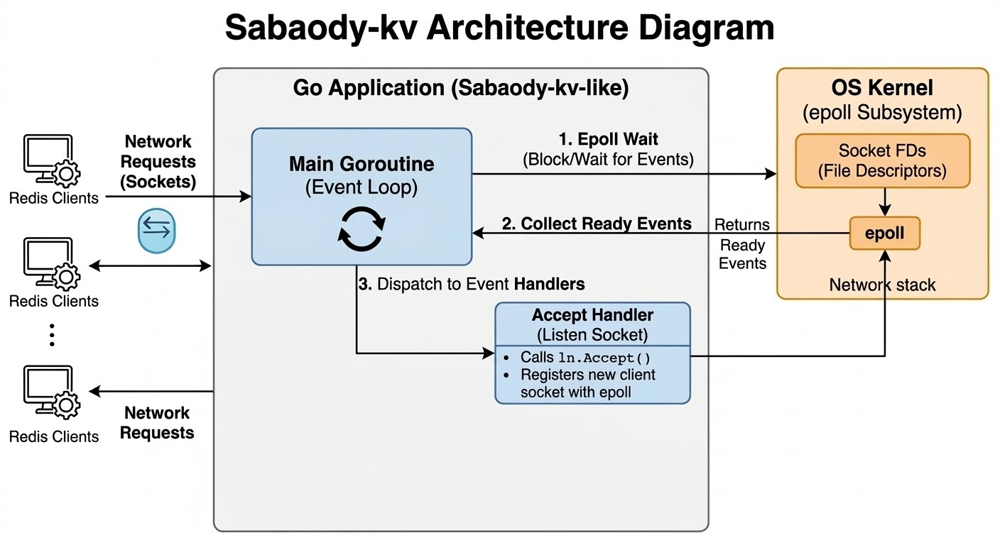
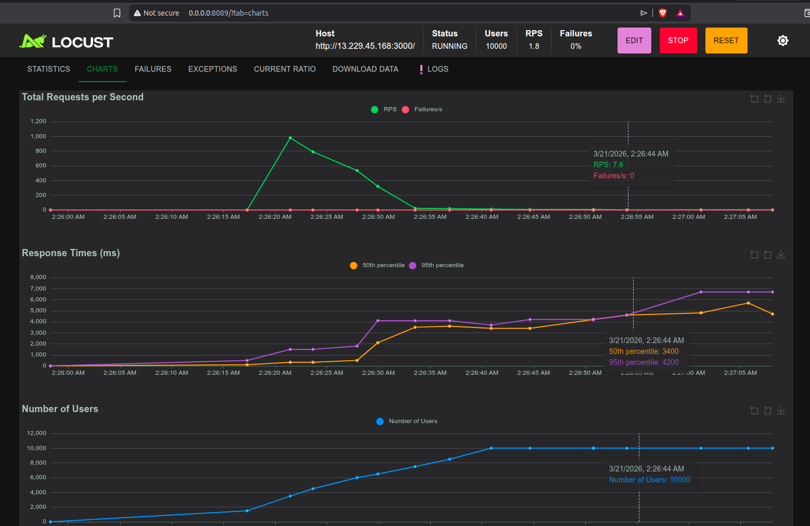
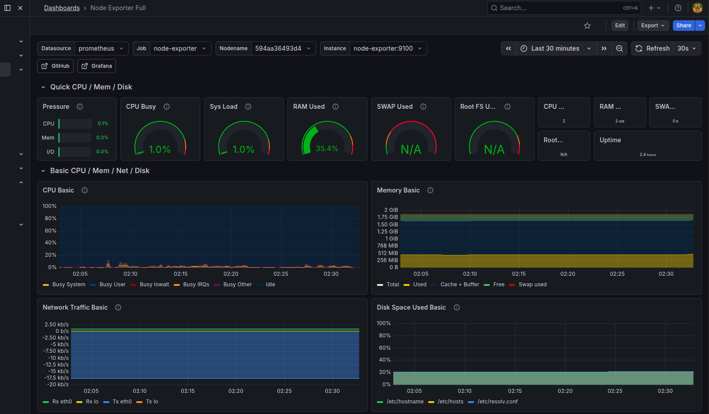

<br />
<div align="center">
  <h3 align="center">Sabaody-KV</h3>
  <p align="center">
    A minimalist, high-performance in-memory key-value cache built from scratch in Go.
    <br />
    <a href="#architecture"><strong>Explore the docs »</strong></a>
  </p>
</div>

<details>
  <summary>Table of Contents</summary>
  <ol>
    <li><a href="#about-the-project">About The Project</a></li>
    <li><a href="#architecture--design">Architecture & Design</a></li>
    <li><a href="#benchmarks--load-testing">Benchmarks & Load Testing</a></li>
    <li><a href="#getting-started">Getting Started</a></li>
    <li><a href="#roadmap--future-features">Roadmap & Future Features</a></li>
    <li><a href="#current-problems">Current Problems</a></li>
  </ol>
</details>

## About The Project
> "What I cannot create, I do not understand." – Richard Feynman

**Sabaody-KV** is a minimalist in-memory key-value cache built from scratch in Go. This project is a deep dive into OS  internals, networking, and high-concurrency systems.

## Architecture & Design

<div align="center">


</div>

## Performance Benchmarks & Load Testing

To validate the efficiency of the non-blocking I/O multiplexing architecture, a load test was conducted using **Locust**. The system demonstrated stable performance under high concurrency.

**Test Environment & Parameters:**
* **Infrastructure:** Single AWS EC2 `t3.small` instance (2 vCPU, 2GB RAM).
* **Target Load:** 10,000 concurrent TCP connections.
* **Ramp-up Rate:** 500 connections/second.

**Results:**
The server successfully accepted and maintained 10,000 concurrent connections without exhausting system resources or crashing, proving the scalability of the Epoll-based event loop implementation.

**Test Results (Summary):**
The server successfully accepted and maintained all connections without exhausting system resources or crashing. Zero failures were recorded during the stress test.

| Metric | Value |
| :--- | :--- |
| **Total Requests** | 13,200 |
| **Failures** | 0 (0%) |
| **Total RPS** | ~69.75 |
| **Min Response Time** | 88 ms |
| **Median Response Time** | 4,700 ms |
| **95%ile Response Time** | 7,500 ms |
| **Max Response Time** | 7,894 ms |

<div align="center">
  
  
</div>

## Getting Started

### Prerequisites
* Go 1.24+
* Linux/macOS (for advanced syscall features)

### Running the Server
```bash
# Clone the repository
git clone https://github.com/cocvu99/sabaody-kv

# Start the TCP server (Using Thread-pool method)
go run thread-pool/main.go

# Start the TCP server (Using I/O Multiplexing method)
go run cmd/main.go
```

## Roadmap & Future Features

### 1. Networking & Concurrency
- [x] **Persistent TCP Server**: Handles multiple requests over a single connection to minimize handshake overhead.
- [x] **Worker Pool**: Efficiently manages Goroutines to reuse system resources and limit parallel tasks.
- [x] **I/O Multiplexing**: High-performance, non-blocking TCP server capable of handling thousands of concurrent connections (Epoll/Kqueue).
- [ ] **Shared-nothing Architecture**: Designed to minimize lock contention and boost horizontal scalability.

### 2. Protocol & Commands
- [ ] **RESP Implementation**: Full support for the Redis Serialization Protocol for client compatibility.
- [ ] **Key-Value Operations**: Standard commands: `SET`, `GET`, `DEL`, `EXISTS`.
- [ ] **Time-to-Live (TTL)**: Automatic data expiration using `EXPIRE` and `TTL` commands.
- [ ] **Atomic Operations**: Ensuring data integrity during concurrent access.

### 3. Advanced Data Structures
- [ ] **Sets & Sorted Sets**: Support for `SADD`, `SMEMBERS`, `ZADD`, and `ZRANK`.
- [ ] **Probabilistic Structures**: Efficient existence checks using Bloom Filters and frequency counting with Count-Min Sketch.
- [ ] **Geospatial & Bitmaps**: (Planned) Advanced data types for complex indexing.

### 4. System & Reliability
- [ ] **Cache Eviction**: Automated memory management via Approximated LRU/LFU policies.
- [ ] **Persistence**: Data durability through RDB snapshots and AOF (Append Only File).
- [ ] **Graceful Shutdown**: Ensures zero data loss and safe connection termination during exit.
- [ ] **Monitoring**: Real-time statistics via the `INFO` command.

## Current Problems
EN: Current problem: Handling sudden TCP connection interruptions; the functional operations of the Cache Server have not yet been implemented.
